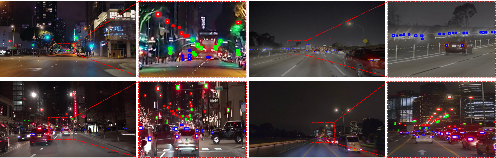

# YouTube Driving Light Detection (YDLD) Dataset

## Overview

The **YouTube Driving Light Detection (YDLD) dataset**, designed to address the multi-source light detection (LD) problem under various driving scenarios. Despite the critical importance of LD for autonomous driving and night vision, this area has not received as much focus as other object detection (OD) tasks. One significant reason for this oversight is the lack of publicly available LD benchmark datasets.  The **YDLD** dataset is contains 3.5k images and 116k box annotations for three light sources: a vehicle light, a traffic signal, and a streetlight.




## Update
 * **2024.06.11**: This repo is created. 


The full YDLD dataset will be released soon!

## YDLD Benchmark Results
<center>
  
| Detectors                                      | Publications | Year | mAP  | AP50 | AP75 | APvt | APt  | APs  | APm  |
|:----------------------------------------------:|:------------:|:----:|:----:|:----:|:----:|:----:|:----:|:----:|:----:|
| Libra R-CNN                                    |     CVPR     | 2019 |  8.6 | 16.6 |  8.2 |  0.2 |  6.1 | 10.2 | 40.3 |
| Faster R-CNN                                   |   NeurIPS    | 2015 |  8.9 | 17.1 |  8.3 |  0.1 |  6.2 | 10.5 | 41.5 |
| Cascade R-CNN                                  |     CVPR     | 2018 | 10.2 | 18.7 | 10.1 |  0.3 |  7.3 | 12.5 | 45.8 |
| YOLOF                                          |     CVPR     | 2021 |  5.7 | 13.3 |  4.3 |  0.0 |  3.7 |  7.2 | 27.4 |
| RetinaNet                                      |     ICCV     | 2017 |  8.1 | 20.2 |  5.2 |  2.2 |  4.8 | 20.6 | 37.2 |
| ATSS                                           |     CVPR     | 2020 | 15.6 | 33.7 | 12.5 |  4.7 | 11.7 | 25.3 | 42.7 |
| YOLOX                                          |     CVPR     | 2021 | 17.9 | 42.3 | 12.1 |  8.1 | 14.4 | 27.5 | 39.1 |
| PAA                                            |     ECCV     | 2020 | 21.6 | 48.0 | 16.1 |  9.7 | 18.0 | 34.6 | 43.6 |
| Deformable DETR                                |     ICLR     | 2021 | 16.7 | 41.9 |  9.7 |  7.3 | 14.0 | 26.4 | 34.4 |
| DINO                                           |     ICLR     | 2023 | 22.6 | 51.6 | 16.3 | 10.5 | 19.0 | 35.2 | 47.2 |
| SoftTeacher                                    |     ICCV     | 2021 |  8.4 | 15.9 |  7.9 |  0.3 |  6.4 |  9.3 | 39.4 |
| MeanTeacher                                    |   NeurIPS    | 2017 | 14.4 | 32.5 | 10.7 |  9.0 | 16.0 | 25.2 | 16.2 |
| ConsistentTeacher                              |     CVPR     | 2023 | 19.1 | 42.6 | 14.7 |  7.4 | 15.0 | 31.7 | 42.7 |
| CEASC                                          |     CVPR     | 2023 |  7.5 | 19.3 |  4.4 |  2.3 |  4.7 | 18.5 | 33.1 |
| FSANet                                         |  IEEE TGRS   | 2020 | 10.4 | 24.9 |  7.1 |  2.3 |  7.7 | 16.1 | 34.1 |
| RFLA w/t RetinaNet                             |     ECCV     | 2022 | 10.8 | 30.4 |  5.1 |  5.9 |  9.8 | 29.7 | 37.7 |
| NWD-RKA                                        | ISPRS P&RS   | 2022 | 15.3 | 36.6 |  8.2 |  5.1 | 12.7 | 28.4 | 42.2 |
| RFLA w/t PAA †                                 |     ECCV     | 2022 | 21.6 | 50.8 | 14.7 | 11.0 | 19.4 | 33.4 | 40.2 |
| SS-FLD w/t DINO                                |   Proposed   |      | 25.6 | 57.6 | 19.1 | 12.7 | 23.1 | 38.6 | 48.0 |
| SS-FLD w/t RFLD                                |   Proposed   |      | 26.0 | 58.3 | 19.0 | 12.8 | 24.8 | 39.2 | 43.4 |


## Dataset Download
|                              |            Google Drive             |            Description            |
|:----------------------------:|:-----------------------------------:|:----------------------------------:|
| YDLD sample images           |               [link](https://drive.google.com/file/d/1RyFzS1q0rxtUx_Wt18Mbuj3i48TwY1kg/view?usp=drive_link)                 | A hundred sample images from the YDLD dataset. |

## Weight File Download

|                Detector              |            Google Drive             |       mAP             |         Description            |
|:----------------------------:|:-----------------------------------:|:-----------------------------------:|:----------------------------------:|
| DINO          |               [ link](https://drive.google.com/file/d/12oX3iSd9BGsxtkgNWjXiY75bxoq94UU3/view?usp=drive_link)          |  22.6     | The pre-trained weight file for DINO detector. |
## Installation

 1. Clone the repo
 ```
git clone https://github.com/YDLD-dataset/YDLD
 ```

 2. Install MMdetection. Our provided model is trained on MMDetection. We recommend to install <a href="https://github.com/open-mmlab/mmdetection">MMDetection</a>.<br> Please install the MMDetection(https://github.com/open-mmlab/mmdetection) in advance. 

3. Please run the following commands in YDLD root path to run demo file. 

```
cd YDLD
python setup.py develop
```


## Running the demo

1. Download dataset

2. Upzip the YDLD sample dataset in appropriate directory.

```
upzip YDLD_samples.zip
```

4. Download weight file which is we provide.

5. Please run the following commands in YDLD root path to run demo. 
```
python demo/image_demo.py <img_path> configs/ydld/ydld_dino_12e.py --weights <checkpoint path> --device gpu
```

## License

This project is licensed under CC BY-NC-SA 4.0 license. Redistribution and use of the dataset for non-commercial purposes should follow this license. 
