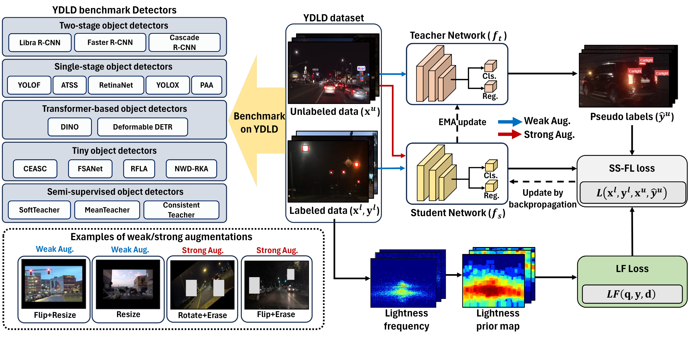

# YouTube Driving Light Detection (YDLD) Dataset

## Overview

The **YouTube Driving Light Detection (YDLD) dataset**, designed to address the multi-source light detection (LD) problem under various driving scenarios. Our YDLD dataset is designed to detect multiple light sources in a variety of scenarios, including traffic lights, car lights, and streetlights. Accurate detection of these light sources is crucial for recognizing objects, predicting behaviors, and understanding the environment, particularly in the context of autonomous driving and surveillance systems.  The **YDLD** dataset contains 3.5k images and 116k box annotations for three light sources.


## Update
 * **2024.06.11**: Update the YDLD sample dataset, data loader, and demo codes. 
 * **2024.06.11**: This repo is created. 


* **The full YDLD dataset will be released soon!**


## SS-FLD 



* We implement and evaluate the different types of the recent 20 detectors. To improve model generalization and robustness, we apply SS-FLDs for the detectors. Our SS-FLD consists of weak/strong augmentations, a lightness focal loss to focus more on false positives, and the lightness spatial attention prior for embedding geometrical context over light sources.
* We will open our SS-FLD code soon.

## YDLD Benchmark Leaderboard
<center>
  
|                                       |  Detectors                                      | Publications | Year | mAP  | AP50 | AP75 | APvt | APt  | APs  | APm  |
|:----------------------------------------------:|:----------------------------------------------:|:------------:|:----:|:----:|:----:|:----:|:----:|:----:|:----:|:----:|
|1| SS-FLD w/t RFLD                                |   Proposed   |      | 26.0 | 58.3 | 19.0 | 12.8 | 24.8 | 39.2 | 43.4 |
|2| SS-FLD w/t DINO                                |   Proposed   |      | 25.6 | 57.6 | 19.1 | 12.7 | 23.1 | 38.6 | 48.0 |
|3| [DINO](https://github.com/YDLD-dataset/YDLD/blob/master/mmdetection/configs/ydld/ydld_dino_12e.py)                                             |     ICLR     | 2023 | 22.6 | 51.6 | 16.3 | 10.5 | 19.0 | 35.2 | 47.2 |
|4| RFLA w/t PAA                                 |     ECCV     | 2022 | 21.6 | 50.8 | 14.7 | 11.0 | 19.4 | 33.4 | 40.2 |
|5| PAA                                            |     ECCV     | 2020 | 21.6 | 48.0 | 16.1 |  9.7 | 18.0 | 34.6 | 43.6 |
|6| ConsistentTeacher                              |     CVPR     | 2023 | 19.1 | 42.6 | 14.7 |  7.4 | 15.0 | 31.7 | 42.7 |
|7| YOLOX                                          |     CVPR     | 2021 | 17.9 | 42.3 | 12.1 |  8.1 | 14.4 | 27.5 | 39.1 |
|8| Deformable DETR                                |     ICLR     | 2021 | 16.7 | 41.9 |  9.7 |  7.3 | 14.0 | 26.4 | 34.4 |
|9| ATSS                                           |     CVPR     | 2020 | 15.6 | 33.7 | 12.5 |  4.7 | 11.7 | 25.3 | 42.7 |
|10| NWD-RKA                                        | ISPRS P&RS   | 2022 | 15.3 | 36.6 |  8.2 |  5.1 | 12.7 | 28.4 | 42.2 |
|11| MeanTeacher                                    |   NeurIPS    | 2017 | 14.4 | 32.5 | 10.7 |  9.0 | 16.0 | 25.2 | 16.2 |
|12| RFLA w/t RetinaNet                             |     ECCV     | 2022 | 10.8 | 30.4 |  5.1 |  5.9 |  9.8 | 29.7 | 37.7 |
|13| FSANet                                         |  IEEE TGRS   | 2020 | 10.4 | 24.9 |  7.1 |  2.3 |  7.7 | 16.1 | 34.1 |
|14| Cascade R-CNN                                  |     CVPR     | 2018 | 10.2 | 18.7 | 10.1 |  0.3 |  7.3 | 12.5 | 45.8 |
|15| Faster R-CNN                                   |   NeurIPS    | 2015 |  8.9 | 17.1 |  8.3 |  0.1 |  6.2 | 10.5 | 41.5 |
|16| Libra R-CNN                                    |     CVPR     | 2019 |  8.6 | 16.6 |  8.2 |  0.2 |  6.1 | 10.2 | 40.3 |
|17| SoftTeacher                                    |     ICCV     | 2021 |  8.4 | 15.9 |  7.9 |  0.3 |  6.4 |  9.3 | 39.4 |
|18| RetinaNet                                      |     ICCV     | 2017 |  8.1 | 20.2 |  5.2 |  2.2 |  4.8 | 20.6 | 37.2 |
|19| CEASC                                          |     CVPR     | 2023 |  7.5 | 19.3 |  4.4 |  2.3 |  4.7 | 18.5 | 33.1 |
|20| YOLOF                                          |     CVPR     | 2021 |  5.7 | 13.3 |  4.3 |  0.0 |  3.7 |  7.2 | 27.4 |


**We will update this leaderboard if you submit your detection results to us. We will notice the contactable E-mail when we release full dataset.**


## Dataset Download
|             Dataset                 |            Google Drive             |            Description            |
|:----------------------------:|:-----------------------------------:|:----------------------------------:|
| YDLD sample images           |               [link](https://drive.google.com/file/d/1RyFzS1q0rxtUx_Wt18Mbuj3i48TwY1kg/view?usp=drive_link)                 | A hundred sample images of the YDLD dataset. |

## Weight File Download

|                Detector              |            Google Drive             |       mAP             |         Description            |
|:----------------------------:|:-----------------------------------:|:-----------------------------------:|:----------------------------------:|
| [DINO](https://github.com/YDLD-dataset/YDLD/blob/master/mmdetection/configs/ydld/ydld_dino_12e.py)          |               [ link](https://drive.google.com/file/d/12oX3iSd9BGsxtkgNWjXiY75bxoq94UU3/view?usp=drive_link)          |  22.6     | The pre-trained weight file for DINO detector. |

## Prerequisites
* We highly recommend installing the recommended settings of mmdetection on your system. Please refer this [link](https://mmdetection.readthedocs.io/en/latest/get_started.html) 
* Python >= 3.7
* CUDA >= 9.2
* PyTorch >= 1.8


## Installation

 1. Clone the repo
 ```
git clone https://github.com/YDLD-dataset/YDLD
 ```

 2. Install MMdetection. Our provided model is trained on MMDetection. We recommend to install <a href="https://github.com/open-mmlab/mmdetection">MMDetection</a>.<br> Please install the MMDetection(https://github.com/open-mmlab/mmdetection) in advance. 

3. Please run the following commands in YDLD root path to run demo file. 

```
cd YDLD
cd mmdetection
python setup.py develop
```
4. Install aitodpycocotools library as follows:
```
pip install "git+https://github.com/jwwangchn/cocoapi-aitod.git#subdirectory=aitodpycocotools"
```


## Running the demo

1. Download YDLD sample dataset. 

3. Upzip the YDLD sample dataset in appropriate directory.

```
upzip YDLD_samples.zip
```

4. Download weight file which is we provide.

5. Please run the following commands in mmdetection path to run demo. 
```
python demo/image_demo.py <your img path> configs/ydld/ydld_dino_12e.py --weights <your checkpoint path> --device cuda
```

## Demo Results

**Click to view larger images.**


## License

This project is licensed under CC BY-NC-SA 4.0 license. Redistribution and use of the dataset for non-commercial purposes should follow this license. 
